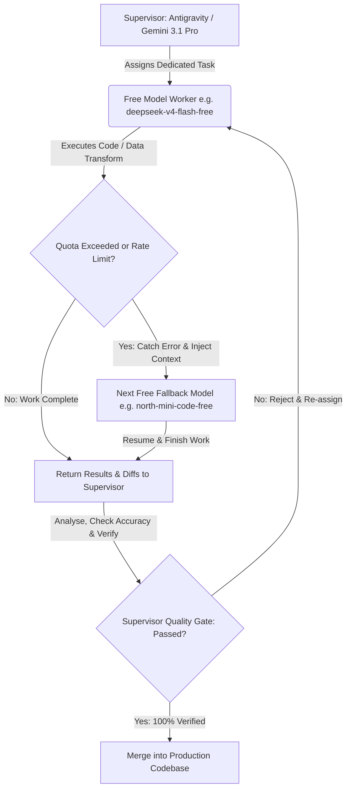

# OpenCode Models Handbook & Multi-Agent Divide & Conquer Protocol

## 1. Governance & Automatic Quota-Fallback Protocol
To achieve maximum computational velocity while conserving proprietary token budgets, this project strictly adheres to a **Divide and Conquer Multi-Agent Protocol**. All atomic development tasks—refactoring, data deduplication, UI styling, linguistic verification, and test generation—are dispatched asynchronously to open-source **OpenCode Free Models** via PowerShell CLI commands.

### 🛡️ Automatic Quota-Fallback & Session Continuity
To ensure that ongoing work is **never stalled or terminated** due to token rate limits, hourly quotas, or model availability constraints, all OpenCode executions must enforce an automatic recovery mechanism:

1. **Free Model Prioritization**: Always launch tasks using free, open-source models first.
2. **Quota Exemption & Automatic Rotation**: If an active model returns an HTTP 429 (Too Many Requests), quota exceeded, or context overload exception, the execution engine must immediately catch the exception and switch to the next available free model in the fallback chain:
   ```
   deepseek-v4-flash-free -> north-mini-code-free -> nemotron-3-ultra-free -> mimo-v2.5-free -> laguna-s-2.1-free -> big-pickle
   ```
3. **Session Continuity & Context Injection**: The replacement model must never start blind. Upon quota fallback, the automated supervisor injects the existing conversation transcript, previous prompts, git diff state, and current tool execution context directly into the new model's initial prompt (or resumes via `--continue` session ID). The replacement model seamlessly picks up from the exact checkpoint without repeating completed work.

---

## 2. OpenCode Models Handbook & Command Index

### 🟢 Free Open-Source Models (Primary Workforce)
Always assign tasks to these models first according to their architectural specialities:

```powershell
# High-Speed Syntactic Transforms & Refactoring
opencode --model opencode/deepseek-v4-flash-free

# Concise Code Logic, Utility Scripts & Regex Parsing
opencode --model opencode/north-mini-code-free

# Deep Contextual Reasoning, German Linguistics & CEFR Auditing
opencode --model opencode/nemotron-3-ultra-free

# Data Transformation, JSON Deduplication & Schema Integrity
opencode --model opencode/mimo-v2.5-free

# UI/UX Responsive Layouts & Tailwind CSS Styling
opencode --model opencode/laguna-s-2.1-free

# Heavy Batch Data Processing & Full Repository Scans
opencode --model opencode/big-pickle
```

### 💎 Premium Models (Reference & Escalation Fallback)
Reserved strictly for complex architectural deadlocks, critical supervisor verification, or when all free tiers are temporarily exhausted:

```powershell
opencode --model opencode/gpt-5
opencode --model opencode/gpt-5-codex
opencode --model opencode/gpt-5.5
opencode --model opencode/claude-sonnet-5
opencode --model opencode/claude-opus-4.8
opencode --model opencode/gemini-3.6-flash
opencode --model opencode/deepseek-v4-pro
opencode --model opencode/kimi-k2.7-code
opencode --model opencode/glm-5.2
opencode --model opencode/minimax-m3
```

### 🔍 Discovery & Filtering Commands
To view all supported models or filter exclusively for free open-source worker models:
```powershell
opencode models
opencode models | Select-String "free"
```
To search specifically for the core free rotation suite:
```powershell
opencode models | Select-String "free|big-pickle|laguna|mimo|nemotron|north|deepseek"
```

---

## 3. Divide & Conquer Task Assignment Matrix

| OpenCode Worker Model | Primary Speciality | Optimal Task Assignments in DeutschLern | Quota Fallback Model |
| :--- | :--- | :--- | :--- |
| `opencode/deepseek-v4-flash-free` | **High-Speed Syntactic Transforms** | Bulk React hook migration (`useLevelVocabulary`), boilerplate generation, component interface updates. | `opencode/north-mini-code-free` |
| `opencode/north-mini-code-free` | **Concise Logic & Utilities** | AST parsing, TypeScript type enforcement, diagnostic helper scripts, quick CLI debugging. | `opencode/mimo-v2.5-free` |
| `opencode/nemotron-3-ultra-free` | **German Linguistic & CEFR Logic** | Verifying German grammar cases (Nominativ, Akkusativ, Dativ, Genitiv), vocabulary sentence correctness, CEFR grading. | `opencode/deepseek-v4-flash-free` |
| `opencode/mimo-v2.5-free` | **Data deduplication & JSON ETL** | Reading `data.json` files, stripping out exact and partial duplicates, schema alignment against Prisma 3NF SQLite DB. | `opencode/big-pickle` |
| `opencode/laguna-s-2.1-free` | **UI/UX Aesthetics & Animations** | Tailwind CSS v4 token verification, Flashcard 3D flip animations, dark/light contrast styling, responsiveness. | `opencode/deepseek-v4-flash-free` |
| `opencode/big-pickle` | **Heavy Batch & Large File Scans** | Full repository redundancy sweeping, scanning multi-thousand-line backup datasets (`*.json`, `*.bak`). | `opencode/mimo-v2.5-free` |

---

## 4. Operational Workflow (Divide -> Execute -> Verify -> Merge)



### Supervisor Role (Antigravity / Gemini 3.1 Pro)
As the Senior AI Supervisor, Antigravity never blindly accepts worker outputs. Upon worker completion:
1. **Analyze**: Inspect syntax trees, bundle size impact, and architectural cleanliness.
2. **Verify Accuracy**: Cross-reference output against existing CEFR standards, Prisma schemas, and UX design guidelines.
3. **Compare & Test**: Check before/after state to ensure zero regression or broken imports.
4. **Merge**: Execute the integration into `dev.db` or source code files and document progress in `Report.md`.
